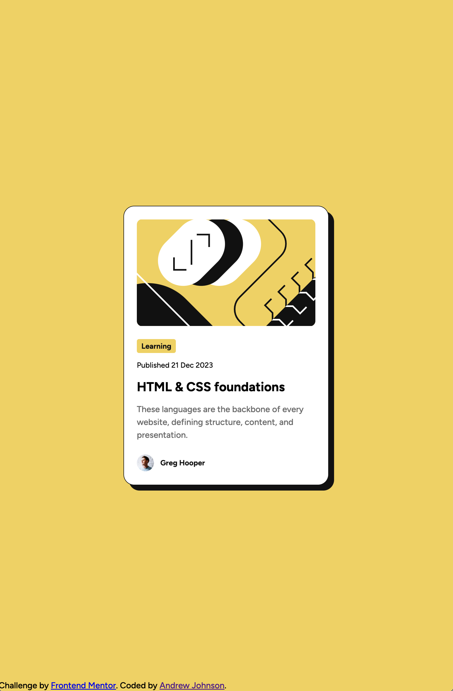

# Frontend Mentor - Blog preview card solution

This is a solution to the [Blog preview card challenge on Frontend Mentor](https://www.frontendmentor.io/challenges/blog-preview-card-ckPaj01IcS). Frontend Mentor challenges help you improve your coding skills by building realistic projects. 

## Table of contents

- [Overview](#overview)
  - [The challenge](#the-challenge)
  - [Screenshot](#screenshot)
  - [Links](#links)
- [My process](#my-process)
  - [Built with](#built-with)
  - [What I learned](#what-i-learned)
  - [Continued development](#continued-development)
  - [Useful resources](#useful-resources)
- [Author](#author)


## Overview

### The challenge

Users should be able to:

- See hover and focus states for all interactive elements on the page

### Screenshot



### Links

- Solution URL: [Github](https://github.com/Sensationull/blog-preview-card)
- Live Site URL: [https://sensationull.github.io/blog-preview-card/](https://sensationull.github.io/blog-preview-card/)

## My process

I started out by sketching out a mobile first solution to ensure that portion of the solution would be compeleted. Starting mobile-first helps me adapt to a desktop solution more often than trying to retrofit a desktop solution to mobile. Once I built the initial mobile-first solution, I made slight changes to css of the designs to make the desktop solution work. This involved removing some unecessary classes and fixing some pre-optimized height changes that I had made. 

### Built with

- Semantic HTML5 markup
- CSS custom properties
- Flexbox
- Mobile-first workflow

### What I learned

CSS variables are your friend. The first time I did one of these challenges, I was manually typing out every type and color as needed. It was SO much more efficient to declare a `:root` clause with multiple variable properties inside it and sprinkle them throughout the code as needed. It also helped with Intellisense in VS Code for autocomplete. 

To see how you can add code snippets, see below:

```css
:root {
    --bg-color-yellow: hsl(47deg, 88%, 63%);
    --gray-950: hsl(0deg, 0%, 7%);
    --gray-500: hsl(0deg, 0%, 42%);
    --white: hsl(0deg, 0%, 100%);
}
```

### Continued development

I want to refine my variable usage to extend to typography and spacing. I ended up making classes for each subtle variation in the fonts (typically the sizing). I also spent time manually updating the paddings, having those as variables and knowing how to properly apply them will help in larger codebases where maintainability becomes an issue.  

### Useful resources

- [CSS Custom Properties](https://developer.mozilla.org/en-US/docs/Web/CSS/Using_CSS_custom_properties) - The baseline info on CSS variables.

- [Open Links in new tabs???](https://www.smashingmagazine.com/2008/07/should-links-open-in-new-windows/) - Accessibility concerns around opening links in new windows.

- [CSS Box Shadow](https://css-tricks.com/almanac/properties/b/box-shadow/) - This quick explainer on box shadow helped me get the box shadow just right.

## Author

- Frontend Mentor - [@Sensationull](https://www.frontendmentor.io/profile/Sensationull)
